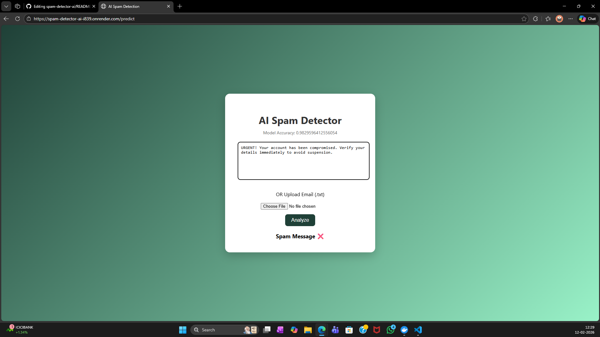
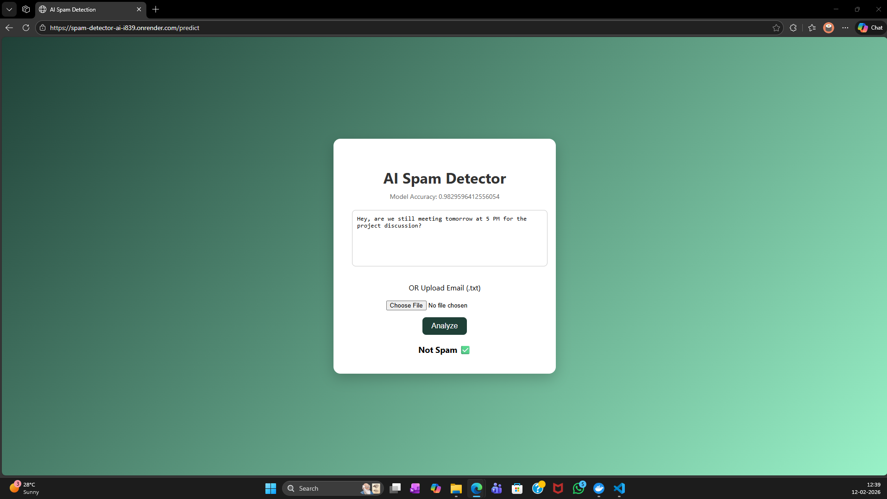
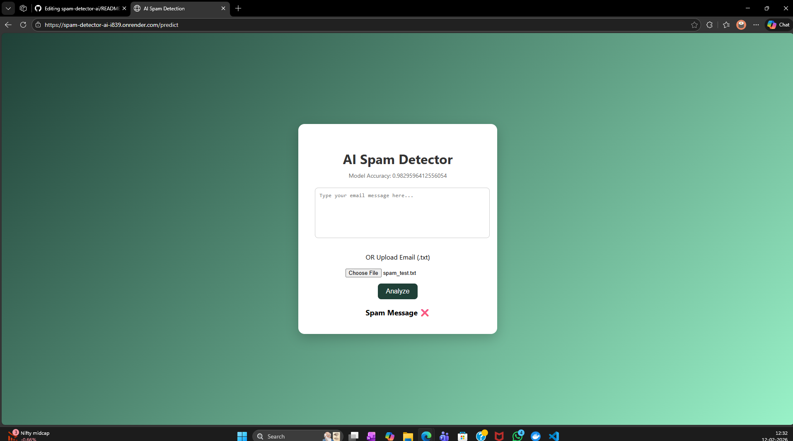

# 🚀 AI Spam Detection Web App

An end-to-end Machine Learning web application that classifies text or uploaded email files as Spam or Not Spam using NLP techniques.

🌐 **Live Demo:**  
https://spam-detector-ai-i839.onrender.com

---

## 🧠 Features

- Real-time spam prediction
- Upload `.txt` email files
- Model accuracy display
- Dockerized application
- Deployed on cloud (Render)

---

## 🏗 Project Architecture

  

---

## 🛠 Tech Stack

- Python
- Scikit-learn (Naive Bayes)
- Flask
- Docker
- Render
- Git & GitHub

---

## 📂 Project Structure

  spam-detector-ai/
  │
  ├── app.py
  ├── spam_train.py
  ├── Dockerfile
  ├── requirements.txt
  ├── spam_model.pkl
  ├── vectorizer.pkl
  ├── accuracy.txt
  └── templates/
  └── index.html

---

## 📸 Application Outputs

### 🔴 Spam Detection Example 1

  

### 🔴 Spam Detection Example 2

  

### 🟢 Not Spam Example

  

### 📂 File Upload Example

  

## 📚 What I Learned

- End-to-end ML pipeline
- Model serialization & loading
- Flask backend integration
- Docker containerization
- Cloud deployment debugging

---

## 📌 Author

Mohammed Yahya  
GitHub: https://github.com/md-yahya1

