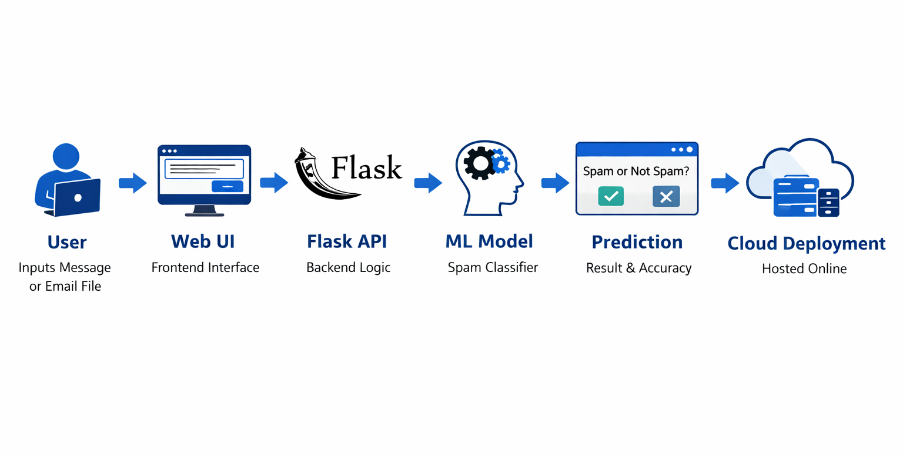
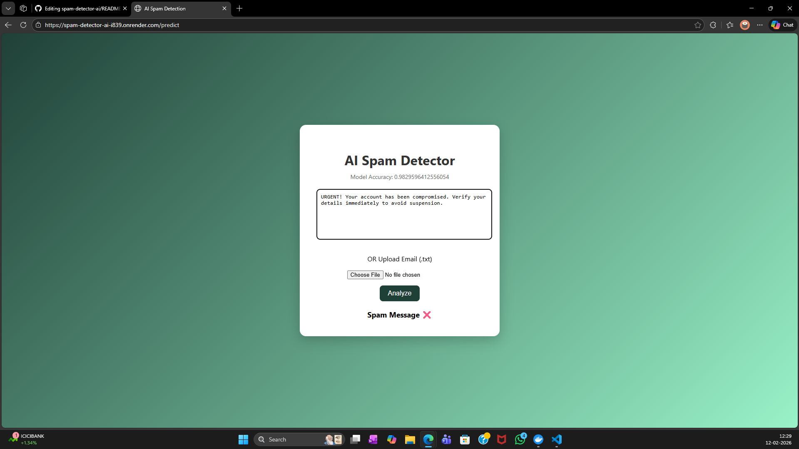
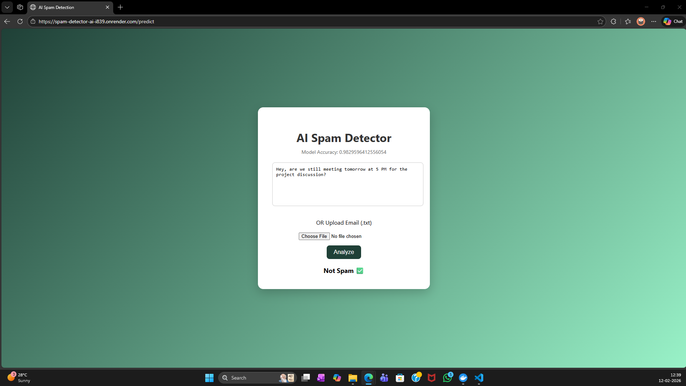
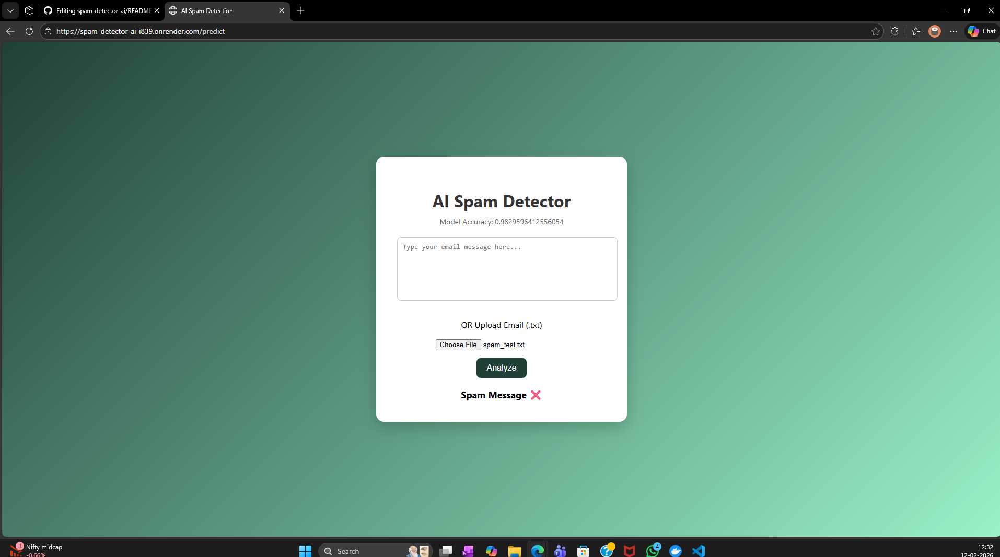

<div align="center">


<br/>

[](https://python.org)
[](https://flask.palletsprojects.com)
[](https://scikit-learn.org)
[](https://docker.com)
[](https://spam-detector-ai-i839.onrender.com)
[](LICENSE)
[](https://github.com/md-yahya1/spam-detector-ai/stargazers)

<br/>

[](https://spam-detector-ai-i839.onrender.com)

</div>

---

## 🧠 What Is This?

**AI Spam Detector** is a production-deployed ML web app that classifies text messages and uploaded `.txt` email files as **Spam** or **Not Spam** in real time. Built on a Naive Bayes + TF-IDF pipeline and served through a lightweight Flask backend — containerized with Docker and live on Render.

> A complete end-to-end ML project: from raw dataset → trained model → serialized pipeline → web API → cloud deployment.

---

## ✨ Key Features

- 🛡️ **Real-Time Classification** — Paste any text and get an instant Spam / Not Spam verdict
- 📂 **File Upload Support** — Upload `.txt` email files directly for analysis
- 📊 **Model Accuracy Display** — The app shows the model's live accuracy on screen
- 🐳 **Dockerized** — Fully containerized for consistent, reproducible deployments
- ☁️ **Cloud Deployed** — Live on Render, accessible from anywhere

---

## 🏗️ Architecture

<p align="center">
  
</p>

---

## 📸 Screenshots

<details>
<summary><b>🔴 Spam Detection — Example 1</b></summary>
<br/>
<p align="center">
  
</p>
</details>

<details>
<summary><b>🔴 Spam Detection — Example 2</b></summary>
<br/>
<p align="center">
  
</p>
</details>

<details>
<summary><b>🟢 Not Spam — Example</b></summary>
<br/>
<p align="center">
  
</p>
</details>

<details>
<summary><b>📂 File Upload — Example</b></summary>
<br/>
<p align="center">
  
</p>
</details>

---

## 🛠️ Tech Stack

<div align="center">

**ML Pipeline**


**Web & Backend**


**DevOps & Deployment**


</div>

---

## 📁 Project Structure

```bash
spam-detector-ai/
│
├── app.py                  # 🌐 Flask app — routes & prediction logic
├── spam_train.py           # 🧪 Model training script
│
├── spam_model.pkl          # 🤖 Serialized Naive Bayes classifier
├── vectorizer.pkl          # 🔤 Serialized TF-IDF vectorizer
├── accuracy.txt            # 📊 Stored model accuracy (displayed in UI)
│
├── templates/
│   └── index.html          # 🖥️  Frontend UI template
│
├── images/                 # 🖼️  Screenshots & architecture diagram
│
├── requirements.txt        # 📦 Python dependencies
└── Dockerfile              # 🐳 Container configuration
```

---

## ⚡ Quick Start

```bash
# 1. Clone the repo
git clone https://github.com/md-yahya1/spam-detector-ai.git
cd spam-detector-ai

# 2. Install dependencies
pip install -r requirements.txt

# 3. (Optional) Retrain the model
python spam_train.py

# 4. Run the app
python app.py
```

Open **http://localhost:5000** in your browser.

---

## 🐳 Docker Deployment

```bash
# Build
docker build -t spam-detector-ai .

# Run
docker run -p 5000:5000 spam-detector-ai
```

---

## 🧪 How the ML Pipeline Works

```
Input Text / .txt File
        ↓
   TF-IDF Vectorizer  ←── vectorizer.pkl
        ↓
  Naive Bayes Classifier  ←── spam_model.pkl
        ↓
  SPAM 🔴  or  NOT SPAM 🟢
```

---

## 🗺️ Roadmap

- [x] Naive Bayes + TF-IDF classification pipeline
- [x] Flask REST backend
- [x] `.txt` file upload support
- [x] Docker containerization
- [x] Cloud deployment on Render
- [ ] Confidence score / probability display
- [ ] Support `.eml` and `.pdf` formats
- [ ] Compare SVM / Logistic Regression accuracy
- [ ] Highlight words that triggered spam detection

---

## 📚 What I Learned

- End-to-end ML pipeline — from raw CSV to a deployed, user-facing product
- Model serialization — saving and loading `pickle` files correctly in production
- Flask integration — connecting an ML model to a web backend cleanly
- Docker — writing Dockerfiles and understanding containerized environments
- Cloud deployment debugging — diagnosing issues between local Docker and Render's runtime

---

## 🙌 Acknowledgements

| Resource | Purpose |
|---|---|
| [SMS Spam Collection – Kaggle](https://www.kaggle.com/) | Training dataset |
| [scikit-learn](https://scikit-learn.org/) | ML pipeline |
| [Flask](https://flask.palletsprojects.com/) | Web framework |
| [Docker](https://www.docker.com/) | Containerization |
| [Render](https://render.com/) | Cloud deployment |

---

<div align="center">

**Built from scratch by [Mohammed Yahya](https://github.com/md-yahya1)**

[](https://github.com/md-yahya1)
[](https://www.linkedin.com/in/mohammed-yahya-4b9879326)
[](https://spam-detector-ai-i839.onrender.com)

<br/>

⭐ **Found this useful? Star the repo — it takes 2 seconds and means a lot!** ⭐

<br/>


</div>
